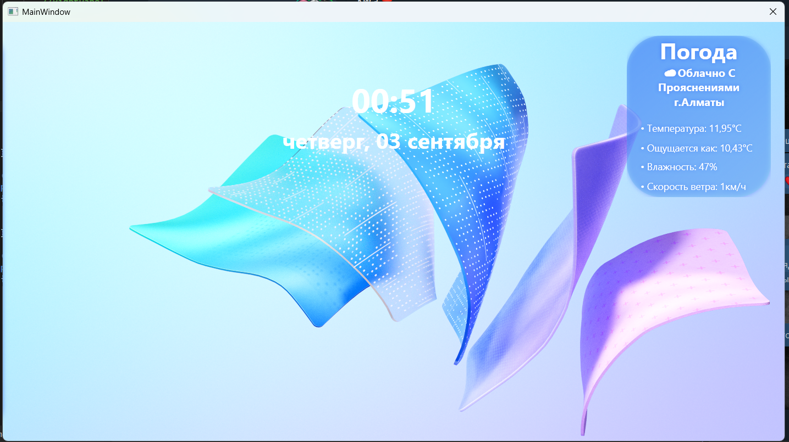
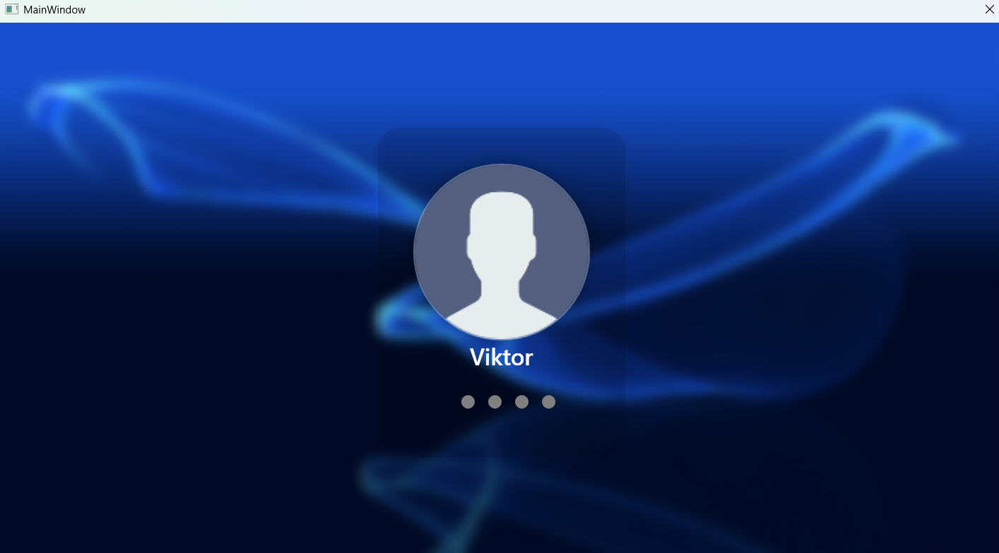
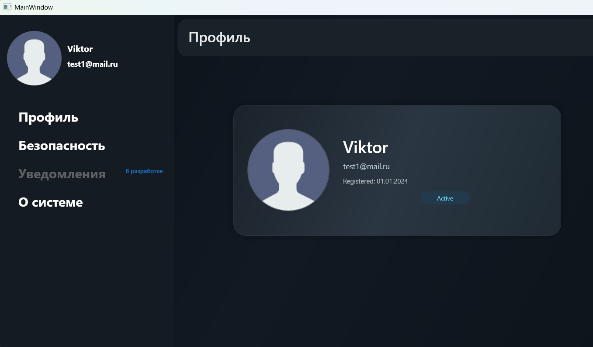
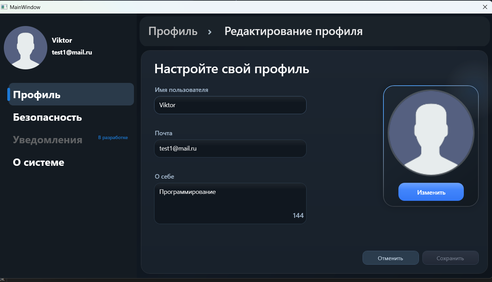
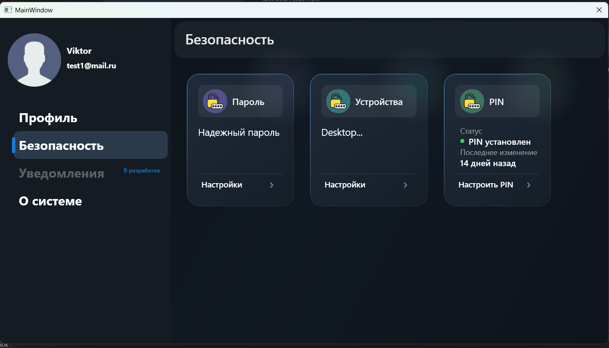

# AstrumApp

Личное настольное приложение на C# и WPF, находящееся в активной разработке.

## О проекте

AstrumApp — личный проект, созданный для практического изучения разработки настольных приложений и языка C#.

Основные цели проекта:

* Изучение C# и .NET
* Изучение WPF и XAML
* Практика проектирования архитектуры приложения
* Работа с пользовательскими данными
* Изучение взаимодействия с внешними API и сервисами
* Практика разработки систем авторизации и защиты приложения

## Основные возможности

* Авторизация и регистрация с использованием Supabase
* Система пользовательских профилей
* Настройки профиля
* Система защиты приложения
* Экран блокировки
* Защита доступа с помощью PIN-кода
* Получение актуальных данных о погоде через API

## Архитектура

В приложении реализована система пользовательских профилей с использованием Supabase для хранения и получения данных. Архитектура предусматривает возможность работы с несколькими профилями.

Отдельно реализована система защиты приложения, отвечающая за проверку доступа и хранение данных, необходимых для защиты.

### Система профилей

Данные пользователя хранятся в Supabase.

Приложение получает необходимые данные пользователя и управляет его сессией после авторизации по электронной почте и паролю.

В дальнейшем планируется возможность работы с несколькими сохранёнными профилями и переключения между ними.

### Система защиты

Основная схема работы системы:

**PIN-код → проверка → разблокировка приложения**

PIN-код не хранится в открытом виде. Для его защиты используется хеширование, благодаря чему исходный PIN невозможно получить обратным преобразованием из сохранённого хеша.

### Взаимодействие с Supabase

Supabase используется для авторизации пользователей, управления сессиями и хранения пользовательских данных.

В дальнейшем рассматривается возможность создания собственного серверного решения, адаптированного непосредственно под потребности AstrumApp.

## Использованные технологии

* **C#**
* **.NET**
* **WPF**
* **XAML**
* **Supabase**
* **REST API**

## Интерфейс

### Экран блокировки

### Главный экран

### Настройки

### Редактор профиля

### Безопасность

## Структура проекта

Проект сочетает пользовательский интерфейс и внутреннюю логику приложения, включая работу с профилями, авторизацией, внешними сервисами и системой защиты.

Архитектура проекта постепенно развивается вместе с добавлением новых возможностей.

## Что я изучил в процессе разработки

В процессе разработки AstrumApp я получил практический опыт:

* разработки настольных приложений на C# и WPF;
* построения архитектуры приложения;
* создания пользовательского интерфейса с помощью XAML;
* работы с пользовательскими данными;
* интеграции внешних сервисов и API;
* реализации авторизации и управления сессиями;
* разработки механизмов защиты и безопасного хранения данных.

## Что планируется

Проект продолжает развиваться. В дальнейшем планируется:

* расширение системы пользовательских профилей;
* улучшение системы защиты;
* развитие пользовательского интерфейса;
* добавление новых возможностей;
* дальнейшее улучшение архитектуры приложения.

## Статус проекта

🚧 **Активная разработка**
